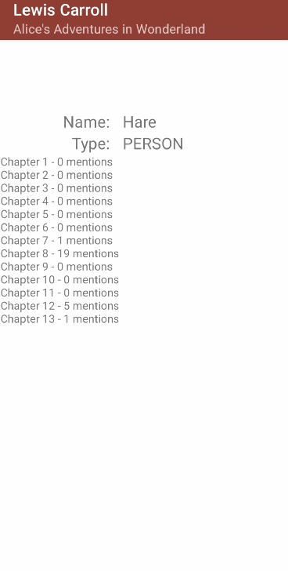

- [Holmes - your private book detector](#holmes---your-private-book-detector)
  - [Demo](#demo)
  - [Architecture](#architecture)
  - [Character Appearances](#character-appearances)
  - [Character Network](#character-network)
  - [UI](#ui)
  - [Future](#future)
  - [Setup](#setup)

<br>
<br>
<br>


# Holmes - your private book detector

Holmes is an app and platform that allows anyone to visualise their books with just their smartphone. By finding all characters and locations within an EPUB book using NLP named entity recognition. It can give visualisations of characters that can help readers remember the plot of chapters by looking at which characters appeared where and with whom they have interacted. 

## Demo




## Architecture
The application is made up of 4 modules which help process and present the book


The server part of the application is run in docker for development and deployment simplicity. 


The project is using GitHub Actions as a CI pipeline


<!--  -->

<!--  -->


When developing Android application, to make the application maintainable and easy to read, the MVVM (Model View ViewModel) architecture was used. 


## Character Appearances
To show a number of times character appeared in a book, two visualisations are used:
- Pie Chart 


<!--  -->

<!--  -->
- Lollipop Chart


## Character Network


The character network allows to visualise connection between characters in the book. 


This is an interactive visualisation, which allows user to define it's parameters.


When it comes to network itself, it can get a bit messy


Therefore by clicking a character, all their links will be highlighted. 


<!--  -->

<!--  -->


<!--  -->

<!--  -->


## UI

<!--  -->

<!--  -->


<!--  -->

When reading the book, location and characters will be highlighted in text, which can be clicked to view in which chapters they appear. 


<!--  -->


## Future
As a proposal for future visualisation, the following prototype was developed.


<!--  -->
<!--  -->


For the full dissertation please click the image below. 

<a href=".pdf/UoB_Roman_Podkovyrin_Final_Year_Project.pdf" class="image fit"></a>
## Setup
This project contains 3 main modules:
1. [`AndroidApp`](AndroidApp/)
2. [`coreNLP`](coreNLP/)
3. [`Server`](Server/)

Each module contains README which documents how they can be run


Start coreNLP
```
docker pull romanpod/corenlp
docker run  --name CoreNLP -p 9000:9000 romanpod/corenlp
```

Start MongoDB
```
docker run --name mongodb -d -p 27017:27017  \
    -v $HOME/db:/data/db mongo --noscripting 
```

To start the server
in `Server/src/main/resources/server.properties` set the following
```
# Core NLP
# coreNLP_url = coreNLP
coreNLP_port = 9000

# Mongo DB
# mongodbUrl = mongodb
mongodbPort = 27017

# Certificates
# certPath = /certificate/cert.jks
# certAlias = holmesCertificate
certPassword = OyBhf&A3F8p&Shz6Xvw3ePisaRMXvBII3Q1i@wawKLw!$4#I3uRVtPe0WGQLQbd#8NaxmdI%!k@NppKSeVsfpDKkuxTWkm9CMmM


# Local Testing
mongodbUrl = localhost
coreNLP_url = localhost
certAlias = holmesCertificateLocal
certPath = /certificate/certlocal.jks
```
Run the server from Intellij for ease

To run android app open Android studio and start an emulator