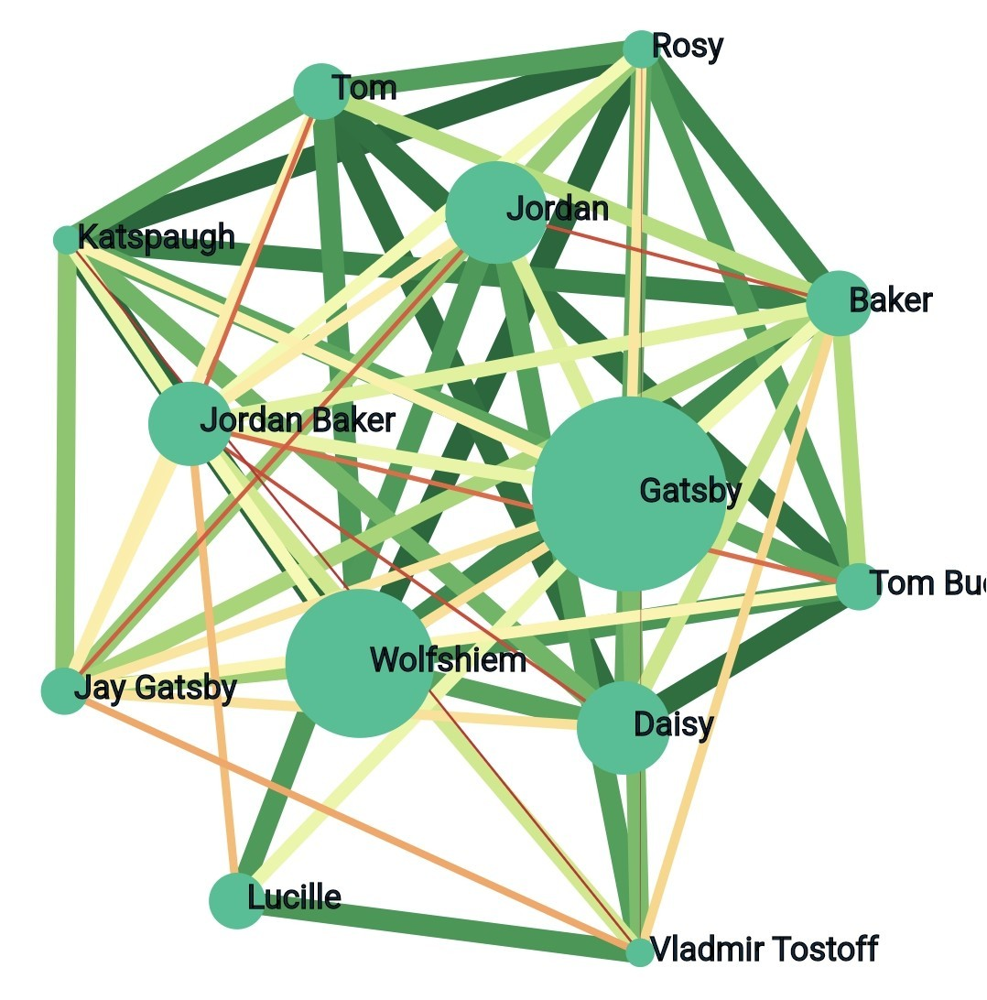

- [Holmes - your privet book detector](#holmes---your-privet-book-detector)
  - [Demo](#demo)
  - [Architecture](#architecture)
  - [Appearances](#appearances)
  - [Character Network](#character-network)
  - [UI](#ui)

# Holmes - your privet book detector

[Describe what the app does]

## Demo

## Architecture
The application is made up of 4 modules which help process and present the book


The server part of the application is run in docker for development and deployment simplicity. 


.


<!--  -->


When developing Android application, to make the application maintainable and easy to read, the MVVM (Model View ViewModel) architecture was used. 


## Appearances


## Character Network


The character network allows to visualise connection between characters in the book. 





## UI


text highlighting


Final Year project
This project contains 3 main modules:
1. `AndroidApp`
2. `coreNLP`
3. `Server`

Each module contains README which documents how they can be run


Start coreNLP
```
docker pull romanpod/corenlp
docker run  --name CoreNLP -p 9000:9000 romanpod/corenlp
```

Start MongoDB
```
docker run --name mongodb -d -p 27017:27017  \
    -v $HOME/db:/data/db mongo --noscripting 
```

To start the server
in `Server/src/main/resources/server.properties` set the following
```
# Core NLP
# coreNLP_url = coreNLP
coreNLP_port = 9000

# Mongo DB
# mongodbUrl = mongodb
mongodbPort = 27017

# Certificates
# certPath = /certificate/cert.jks
# certAlias = holmesCertificate
certPassword = OyBhf&A3F8p&Shz6Xvw3ePisaRMXvBII3Q1i@wawKLw!$4#I3uRVtPe0WGQLQbd#8NaxmdI%!k@NppKSeVsfpDKkuxTWkm9CMmM


# Local Testing
mongodbUrl = localhost
coreNLP_url = localhost
certAlias = holmesCertificateLocal
certPath = /certificate/certlocal.jks
```
Run the server from Intellij for ease

To run android app open Android studio and start an emulator